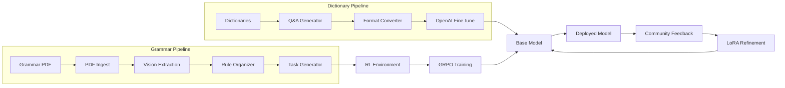

# Stoney Nakoda Pipeline Execution Guide

## Overview

The Stoney Nakoda project contains **two independent but complementary pipelines** for building low-resource language models:

1. **Dictionary→Fine-tuning Pipeline** - Supervised learning via OpenAI fine-tuning
2. **Grammar→RL Pipeline** - Reinforcement learning with grammar-based rewards

### Pipeline Architecture



---

## How to Run the Full Stoney Pipeline

### Complete End-to-End Execution

```bash
# ============================================
# PHASE 1: Setup (One-time)
# ============================================

# Navigate to project directory
cd StoneyNakoda

# Create virtual environment
python -m venv venv
source venv/bin/activate  # Windows: venv\Scripts\activate

# Install all dependencies
pip install -r requirements.txt

# Configure API keys
cp .env.example .env
# Edit .env and add your API keys:
#   OPENAI_API_KEY=sk-...
#   GOOGLE_API_KEY=...
#   HUGGINGFACE_TOKEN=...  (optional, for dataset publishing)
#   WANDB_API_KEY=...      (optional, for experiment tracking)

# ============================================
# PHASE 2: Dictionary Pipeline (Supervised)
# ============================================

# Step 1: Generate Q&A pairs from dictionaries
# Duration: 2-4 hours depending on API speed
# Cost: ~$5-15 (Google Gemini)
python bilingual_qa_generator2.py
# Output: Dictionaries/bilingual_training_set_v2.jsonl (10K Q&A pairs, 5K per language)

# Step 2: Convert to OpenAI format
# Duration: < 1 minute
python finetunesetup.py
# Output: OpenAIFineTune/stoney_train.jsonl (120K examples)
#         OpenAIFineTune/stoney_valid.jsonl (30K examples)

# Step 3: Fine-tune model via OpenAI
# Duration: 1-3 hours (OpenAI handles this)
# Cost: ~$20-50 (GPT-4o-mini, 3 epochs)
python openai_finetune.py
# Output: Fine-tuned model ID (printed to console)
#         Optional: Published to HuggingFace if configured
#         Optional: Metrics tracked in W&B if configured

# ============================================
# PHASE 3: Grammar RL Pipeline
# ============================================

# Step 4: Extract grammar rules from PDF
# Duration: 10-30 minutes depending on PDF size
# Cost: ~$10-30 (OpenAI vision models)
python run_stoney_grammar_pipeline.py
# Output: data/grammar_pages/*.png (rendered PDF pages)
#         data/grammar_extracted_stoney/*.json (raw extractions)
#         data/rl_training_rules_stoney.json (curated rules)
#         data/training_datasets_stoney.jsonl (RL tasks)

# Step 5: Install custom RL environment
# Duration: < 1 minute
pip install -e environments/stoney_nakoda_translation

# Step 6: Run GRPO training (requires RL framework)
# This step depends on your RL training setup
# Use data/training_datasets_stoney.jsonl with prime-rl or similar

# ============================================
# PHASE 4: Deploy & Iterate
# ============================================

# Deploy your fine-tuned model (HuggingFace, API, etc.)
# Collect community feedback
# Generate distillation triplets
# Re-train with LoRA on corrections
```

---

## Alternative Execution Paths

### Quick Option 1: Dictionary Pipeline Only

**Use when:** You need a working translation model fast

```bash
# All-in-one command
python bilingual_qa_generator2.py && \
python finetunesetup.py && \
python openai_finetune.py

# Time: 3-5 hours
# Cost: ~$25-65
# Output: Fine-tuned translation model
```

### Quick Option 2: Grammar RL Pipeline Only

**Use when:** You already have a base model and want grammatical precision

```bash
# All-in-one command
python run_stoney_grammar_pipeline.py && \
pip install -e environments/stoney_nakoda_translation

# Time: 10-30 minutes
# Cost: ~$10-30
# Output: RL training tasks ready for GRPO
```

### Quick Option 3: Combined Sequential

**Use when:** You want the best of both approaches (RECOMMENDED)

```bash
# Run dictionary pipeline first
python bilingual_qa_generator2.py
python finetunesetup.py
python openai_finetune.py

# Wait for fine-tuning to complete, then run grammar pipeline
python run_stoney_grammar_pipeline.py
pip install -e environments/stoney_nakoda_translation

# Time: 4-6 hours total
# Cost: ~$35-95 total
# Output: Fine-tuned model + RL training data for refinement
```

---

## Pipeline Stages Explained

### Dictionary→Fine-tuning Pipeline

| Stage | Script | Input | Output | Duration |
|-------|--------|-------|--------|----------|
| **Q&A Generation** | `bilingual_qa_generator2.py` | `Dictionaries/english_dictionary.jsonl`<br>`Dictionaries/stoney_dictionary.jsonl` | `Dictionaries/bilingual_training_set_v2.jsonl`<br>(10K Q&A pairs) | 2-4 hours |
| **Data Preparation** | `finetunesetup.py` | `bilingual_training_set.jsonl` | `OpenAIFineTune/stoney_train.jsonl`<br>`OpenAIFineTune/stoney_valid.jsonl` | < 1 min |
| **Fine-tuning** | `openai_finetune.py` | Training JSONL files | Fine-tuned model ID | 1-3 hours |

### Grammar→RL Pipeline

| Stage | Script | Input | Output | Duration |
|-------|--------|-------|--------|----------|
| **PDF Ingestion** | `stoney_rl_grammar/pdf_ingest.py` | `Stoney; A Grammar of the Stony Language.pdf` | `data/grammar_pages/*.png` | 1-2 min |
| **Rule Extraction** | `stoney_rl_grammar/rule_extractor.py` | PNG images | `data/grammar_extracted_stoney/*.json` | 5-15 min |
| **Rule Organization** | `stoney_rl_grammar/rule_organizer.py` | Raw JSON extractions | `data/rl_training_rules_stoney.json` | < 1 min |
| **Task Generation** | `stoney_rl_grammar/task_generator.py` | Curated rules | `data/training_datasets_stoney.jsonl` | 5-15 min |

---

## Monitoring Progress

### Dictionary Pipeline

**bilingual_qa_generator2.py:**
- Watch `tqdm` progress bars in console
- Check `Dictionaries/checkpoints_v2/checkpoint_*.jsonl` for recovery points
- Each checkpoint saves every 1000 Q&A pairs

**openai_finetune.py:**
- Console logs show job status every 60 seconds
- Shows: trained tokens, training accuracy, validation loss
- If W&B configured: real-time metrics at wandb.ai
- If HuggingFace configured: datasets published automatically

### Grammar Pipeline

**run_stoney_grammar_pipeline.py:**
- Console shows stage-by-stage progress
- Check `data/grammar_extracted_stoney/*.json` to review extracted rules
- Review `data/rl_training_rules_stoney.json` for curated rule quality

---

## Expected Outputs

After running the **complete pipeline**, your directory will contain:

```
StoneyNakoda/
├── Dictionaries/
│   ├── bilingual_training_set.jsonl     # 150K Q&A pairs
│   └── checkpoints/                     # Recovery checkpoints
├── OpenAIFineTune/
│   ├── stoney_train.jsonl               # 120K training examples
│   └── stoney_valid.jsonl               # 30K validation examples
├── data/
│   ├── grammar_pages/                   # PDF rendered to PNG
│   ├── grammar_extracted_stoney/        # Raw rule extractions
│   ├── rl_training_rules_stoney.json    # Curated grammar rules
│   └── training_datasets_stoney.jsonl   # RL training tasks
└── environments/
    └── stoney_nakoda_translation/       # Installed RL environment
```

**Plus:**
- Fine-tuned OpenAI model ID (from console output)
- Optional: Published datasets on HuggingFace
- Optional: Experiment metrics in Weights & Biases

---

## Cost Breakdown

| Component | Service | Cost Estimate |
|-----------|---------|---------------|
| Q&A Generation (150K pairs) | Google Gemini | $5-15 |
| Fine-tuning (3 epochs, GPT-4o-mini) | OpenAI | $20-50 |
| Grammar PDF extraction (vision models) | OpenAI | $10-30 |
| **Total Pipeline** | | **$35-95** |

**Cost Optimization Tips:**
- Use `gemini-1.5-flash` instead of `gemini-1.0-pro` for cheaper Q&A generation
- Reduce Q&A pairs target (change `pairs_per_language` in script)
- Use `gpt-3.5-turbo` instead of `gpt-4o-mini` for fine-tuning (lower quality)
- Consider open-source alternatives like DeepSeek for zero-cost inference

---

## Troubleshooting Common Issues

### Q&A Generation Fails

**Symptom:** Script crashes or stops generating
**Solutions:**
- Check `Dictionaries/checkpoints_v2/` for last successful checkpoint
- Verify `GOOGLE_API_KEY` is valid
- Check Gemini API quota/rate limits
- Reduce context_size in `bilingual_qa_generator2.py` (line 124, default 6)

### Fine-tuning Validation Errors

**Symptom:** OpenAI rejects training file
**Solutions:**
- Re-run `python finetunesetup.py` to ensure proper format
- Validate JSONL files manually (one JSON object per line)
- Check UTF-8 encoding is preserved

### Grammar Pipeline Produces No Rules

**Symptom:** `rl_training_rules_stoney.json` is empty or minimal
**Solutions:**
- Verify `Stoney; A Grammar of the Stony Language.pdf` exists in project root
- Check `OPENAI_API_KEY` has access to vision models (GPT-4V or similar)
- Review `data/grammar_extracted_stoney/*.json` for extraction quality
- Lower confidence threshold in `stoney_rl_grammar/rule_organizer.py`

### File Not Found Errors

**Symptom:** `FileNotFoundError` for dictionary files
**Solutions:**
- Ensure working directory is project root: `cd StoneyNakoda`
- Verify dictionary files exist in `Dictionaries/` folder
- Check file names match exactly (case-sensitive)

---

## Next Steps After Pipeline Completion

1. **Deploy Fine-tuned Model**
   - Test model via OpenAI API using your fine-tuned model ID
   - Deploy to HuggingFace Spaces for community access
   - Create simple web interface for translation testing

2. **Run RL Training** (if you have GRPO/prime-rl setup)
   - Use `data/training_datasets_stoney.jsonl` as training data
   - Configure GRPO trainer with custom environment
   - Train for grammatical refinement on top of fine-tuned model

3. **Collect Community Feedback**
   - Share model with Stoney Nakoda speakers
   - Collect correction triplets: (Prompt, Wrong Answer, Narrative Correction)
   - Document cultural context and nuances

4. **Iterate with LoRA**
   - Fine-tune on correction triplets using LoRA (Low-Rank Adaptation)
   - Preserve base model while adding community knowledge
   - Create checkpoints and validate improvements

5. **Monitor & Improve**
   - Track Cultural Authenticity Score (CAS) from community ratings
   - Measure linguistic accuracy (perplexity, BLEU, etc.)
   - Implement adaptive checkpoints (revert if quality degrades)

---

## Environment Variables Reference

**Required:**
```bash
OPENAI_API_KEY=sk-...           # OpenAI API key for fine-tuning + vision
GOOGLE_API_KEY=...              # Google Gemini API key for Q&A generation
```

**Optional - Model Overrides:**
```bash
OPENAI_MODEL=gpt-4o-mini                    # Default fine-tuning base model
OPENAI_FINETUNE_MODEL=gpt-4o-mini          # Override fine-tuning model
OPENAI_RESPONSES_MODEL=gpt-5               # Override for Responses API (current latest)
GEMINI_MODEL=gemini-2.0-flash-exp          # Override Gemini model
STONEY_EXTRACTION_MODEL=gpt-5              # Override grammar extraction model
STONEY_TASK_MODEL=gpt-5                    # Override task generation model
```

**Optional - Integrations:**
```bash
HUGGINGFACE_TOKEN=hf_...                   # HuggingFace API token
HUGGINGFACE_DATASET_REPO=username/stoney   # HF dataset repository
HUGGINGFACE_DATASET_PRIVATE=true           # Make dataset private

WANDB_API_KEY=...                          # Weights & Biases API key
WANDB_PROJECT=stoney-nakoda                # W&B project name
WANDB_ENTITY=username                      # W&B username/team
WANDB_RUN_NAME=stoney-finetune-001         # Custom run name
```

---

## Summary

**To run the full Stoney pipeline:**

1. Install dependencies and configure `.env` with API keys
2. Run dictionary pipeline: `bilingual_qa_generator2.py` → `finetunesetup.py` → `openai_finetune.py`
3. Run grammar pipeline: `run_stoney_grammar_pipeline.py`
4. Install RL environment: `pip install -e environments/stoney_nakoda_translation`
5. Deploy, collect feedback, and iterate with LoRA

**Total time:** 4-6 hours
**Total cost:** $35-95
**Result:** Production-ready Stoney Nakoda translation model with grammatical precision

For detailed implementation notes, see [CLAUDE.md](CLAUDE.md).
For complete project documentation, see [README.md](README.md).
