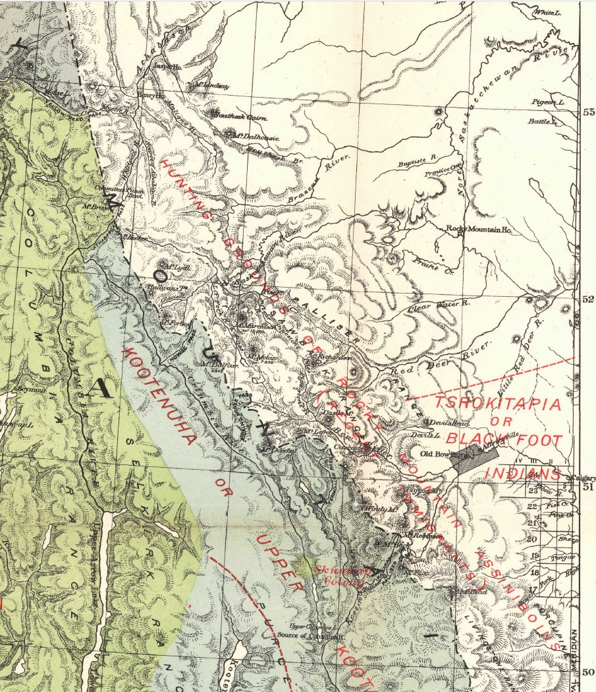
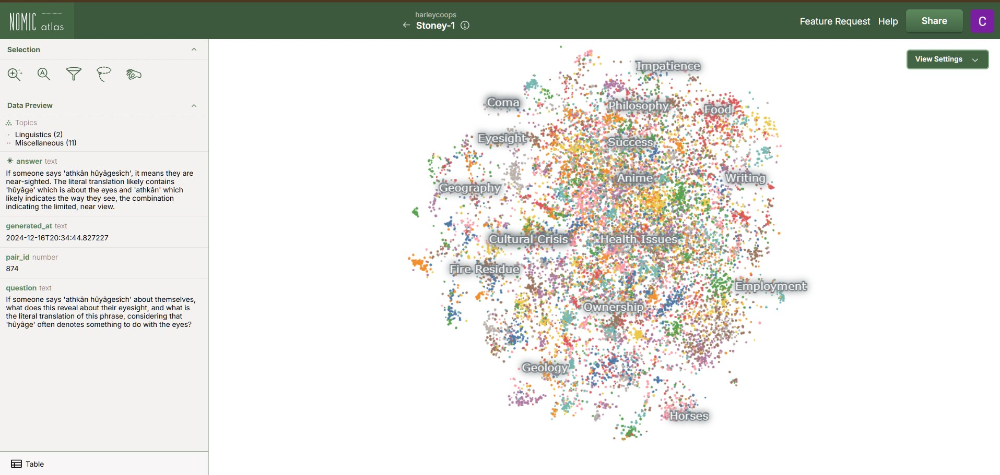
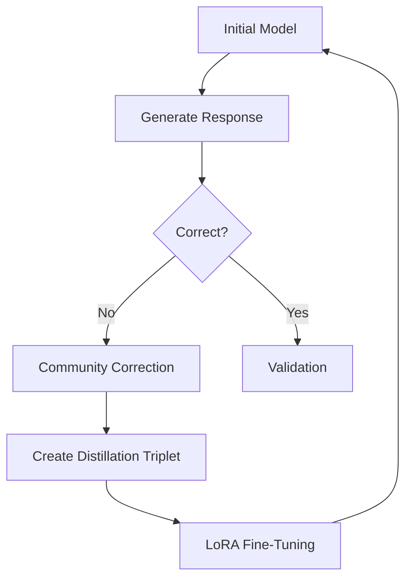

# From Whispers to Voices: A "Community-In-The-Loop" Proposal for Model Distillation and Language Preservation

A working model of the Stoney Nakoda language has been developed and is now available for community-in-the-loop testing in 2025:

- **Model App**: [Stoney Language Model App](https://huggingface.co/spaces/HarleyCooper/StoneyApp)  
- **Training Data**: [StoneyNakoda Training Dataset](https://huggingface.co/datasets/HarleyCooper/StoneyNakoda/blob/main/zSTONEY1_TRAINING_SET.jsonl)


Any First Nations community seeking to apply this approach to their own language is warmly invited to reach out. 

By following this code, you can build a model for any low-resource language. The starting dictionary size should be ~8,000 words.

---

<div align="center">
  <a href="https://huggingface.co/spaces/HarleyCooper/AskAboutCIL" target="_blank">
    
  </a>
</div>

---

## Table of Contents

1. [New Years Day, Canadian Rockies, 2025](#introduction)  
2. [Understanding How AI Learns Stoney Words Using Cosine Similarity](#understanding-how-ai-learns-stoney-words-using-cosine-similarity)
3. [Project Architecture](#project-architecture)  
   - [High-Level System Design](#high-level-system-design)  
   - [Data Flow](#data-flow)  
4. [Detailed Project Structure](#detailed-project-structure)  
5. [Core Components](#core-components)  
   - [Data Generation & Processing](#data-generation--processing)
   - [Model Training](#model-training)
6. [Comprehensive Setup Instructions](#comprehensive-setup-instructions)  
   - [System Requirements](#system-requirements)
   - [Environment Setup](#environment-setup)
   - [Configuration](#configuration)
   - [Initialization](#initialization)
7. [Detailed Usage Pipeline](#detailed-usage-pipeline)  
   1. [Generate Training Data](#1-generate-training-data)  
   2. [Prepare Fine-tuning Data](#2-prepare-fine-tuning-data)  
   3. [Fine-tune Model](#3-fine-tune-model)  
8. [Advanced Model Configuration](#advanced-model-configuration)  
   - [OpenAI Models](#openai-models)  
   - [Google Gemini](#google-gemini)  
   - [Hyperparameters](#hyperparameters)  
9. [Comprehensive Data Formats](#comprehensive-data-formats)  
   - [Dictionary Format](#dictionary-format)  
   - [Q&A Format](#qa-format)  
   - [OpenAI Training Format](#openai-training-format)  
10. [Development Guidelines](#development-guidelines)  
11. [Contributing](#contributing)  
12. [License](#license)  
13. [Acknowledgments](#acknowledgments)  
14. [The Community-in-the-Loop Revolution](#the-community-in-the-loop-revolution)  
    - [Introduction](#introduction-1)  
    - [Conceptual Overview](#conceptual-overview)  
    - [Heart of the Approach](#heart-of-the-approach)  
    - [LoRA Fine-Tuning](#lora-fine-tuning)  
    - [Mathematical Foundations](#mathematical-foundations)  
    - [Mermaid Diagram](#mermaid-diagram)  
    - [Cultural Integrity](#cultural-integrity)  
    - [Data Sources](#data-sources)  
    - [Expanding the Concept](#expanding-the-concept)  
    - [Adaptive Checkpoints](#adaptive-checkpoints)  
    - [Example Workflow](#example-workflow)  
    - [Monitoring & QA](#monitoring--qa)  
    - [Future Directions](#future-directions)  
    - [Glossary](#glossary)  

---

## Introduction

New Years Day, 2025


In my office, there is a murder; a map of one, at least.  


George Mercer Dawson explored the Bow Valley in the late 1800s as a geologist but also as a linguist, noting language on the British Columbia side. His map, though richly colored, stands like a tombstone over the Bow Valley where the Stoney people lived because he made no notes on their language and simply noted the people as "recent immigrants". Much of this work was based on the notes of W. Faser Tolmie and was published after his death. 



What is very obvious from the linguistic patterns among the Haida, Tshimsia, Thlinkit, Kwakiool and Kawitshin dialects nearby is that languages blend like "linguistic DNA," and machine learning could help trace faint threads of lost speech to their roots. Where some see isolation as a curse, in the age of AI, Stoney's isolation turns out to be its strength.

For about two years, I thought about the size of the vector space that would be needed to get a model to self-train on a set of 100% indigenous data, and how that model could refine its grasp of the broader Stoney Language. This is now publicly and freely available. 


Two key releases influenced my thinking of what was possible:

1. [Meta's Llama-3 Model (April 18th, 2024)](https://www.reuters.com/technology/meta-releases-early-versions-its-llama-3-ai-model-2024-04-18/)  
2. [OpenAI Fine-Tuning API (October 2024)](https://openai.com/index/api-model-distillation/)

Both gave me the motivation to build what's presented here. The true innovation here lies in how communities can narratively correct the initially flawed response (about 10% of the time, the model works every time.) then that feeback be passed seamleslly back into the fine-tuning process. The [textbooks](https://globalnews.ca/news/9430501/stoney-nakota-language-textbook/) that the Stoney community created—intended as educational tools—became perfect concept of a model prompts, each chapter or word offering pure indigenous data devoid of external weights or biases to the fine-tuning process.


Early in 2023, I found an original, unpublished sketch by James Hector likely drawn in the summer of 1858 or 1859 along the Bow River in Southern Alberta:


Finding this, and already aware of George Mercer Dawson's work on First Nation's language on the British Columbia side, I was inspired to put the effort in and build a working model of the language and implement the Community-In-The-Loop distillation method.

This sketch shifted my thinking from considering the "Stoney People" to this "Stoney Woman" who saw these same mountains and rivers I see everyday, yet who had a very different way to think about and communicate to the world around her.  The Community-in-the-Loop model distillation will quickly converge this initial model toward fluencey. I suspect this will require the community to correct about 80,000 question and answer pairs and would cost less than $800 in OpenAI computing power. Recent releases by Google and the Chinese Lab DeepSeek, could effectively reduce the cost to zero.  

I think what this project has left me considering most is that a century from now, strangers will live in all our homes and most of what we worry about today will not matter. But we can honor "Stoney Woman" by making sure her language endures, forging a living record in an age of AI. Incredibly, this tool will work with any first nations language, as long as there is a starting dictionary of about 8,000 words. 

**I am freely available to help any First Nation in Canada.**

## Understanding How AI Learns Stoney Words Using Cosine Similarity

Word Embeddings: Mapping Words in Space
Word embeddings are like placing words in a high-dimensional map, where similar words are positioned closer together. For example, "strawberry," "orange," and "cherry" might form a cluster because they are fruits, while "laptop," "Microsoft," and "Android" might cluster elsewhere as tech-related terms. Each axis in this space represents a characteristic of the words, such as their context or meaning.

Context Shapes Meaning
A word's position in this space isn't fixed—it shifts based on context. For instance, the word "apple" could mean a fruit or the tech brand, depending on its surrounding words, like "buy" (tech) or "tree" (fruit). This dynamic placement captures the nuances of meaning.

Cosine Similarity: Measuring Relationships
Cosine similarity quantifies how similar two words are by measuring the angle between their vectors in the embedding space:

- Similar words have vectors pointing in nearly the same direction (cosine similarity close to 1)
- Unrelated words have vectors at a right angle (cosine similarity near 0)
- Opposite meanings have vectors pointing in opposite directions (cosine similarity close to -1)
- For example, "cherry" and "orange" might have a similarity of 0.97, while "cherry" and "laptop" might score 0.24

How AI Learns Stoney Words

- **Stoney Dictionary as a Starting Point:**
  The AI begins with a structured dictionary of Stoney words, including translations, categories, pronunciations, and cultural context.

- **Community Feedback for Learning:**
  The AI makes initial translations, which are often incorrect. Stoney speakers provide corrections, enriched with cultural context, stories, and humor. This feedback helps refine the AI's understanding.

The Role of Cosine Similarity in AI Learning

- The AI uses word embeddings to group Stoney words based on their meaning. For example, it determines whether a word belongs to a category like "fruit," "animal," or "spiritual."
- Community corrections and cosine similarity guide the AI in repositioning words closer to their accurate groupings in the embedding space.

Iterative Refinement
Through repeated feedback and fine-tuning, the AI improves its ability to place Stoney words correctly, not just individually but in the context of sentences and paragraphs. Over time, it develops a detailed, dynamic map of the Stoney language, with words clustered according to their community-informed meanings and uses.

Although this is not cosine similarity, you can see the relationships among words can concepts in Stoney as I have mapped them here:

[](https://atlas.nomic.ai/data/harleycoops/stoney-1/map/8049523d-b620-4da3-962c-c509e08f586f#iE2b)


---

## Project Architecture

This code forms a complete pipeline for training and deploying a Stoney model. It is fully functional—but not correct 100% of the time—and is designed to improve through Community-In-The-Loop feedback. Access the model here:  
[Stoney Language Model App](https://huggingface.co/spaces/HarleyCooper/StoneyApp)

### High-Level System Design

1. **Data Ingestion Layer**  
2. **Processing Pipeline** (Q&A generation, augmentation, conversion)  
3. **Model Training Framework** (fine-tuning, hyperparameters, monitoring)  
4. **Inference Interface** (API endpoint, response formatting, error handling)

### Data Flow

1. Raw dictionary data → Data Ingestion  
2. Processed data → Q&A Generation  
3. Generated Q&A pairs → Training Data Preparation  
4. Prepared data → Model Fine-tuning  
5. Fine-tuned model → Inference Interface  

---

## Detailed Project Structure

```
PUBLICRELEASE/
├── OpenAIFineTune/           # OpenAI fine-tuning files
│   ├── stoney_train.jsonl    # Training dataset
│   └── stoney_valid.jsonl    # Validation dataset
├── checkpoints/              # Model checkpoints
├── .env.example             # Env variables example
├── requirements.txt         # Python dependencies
├── english_dictionary.jsonl
├── stoney_dictionary.jsonl
└── bilingual_training_set.jsonl
```

---

## Core Components

### Data Generation & Processing

- **`bilingual_qa_generator.py`**  
  Generates Q&A pairs from dictionaries, using advanced language generation.

- **`convert_data_format.py`**  
  Supports multiple data formats; validates and enforces schemas.

- **`finetunesetup.py`**  
  Splits data (80/20) with stratified sampling and prepares files.

### Model Training

- **`openai_finetune.py`**  
  Handles fine-tuning, error handling, checkpointing, and logging.

---

## Comprehensive Setup Instructions

### System Requirements

- Python 3.8+  
- 8GB+ RAM (16GB recommended)  
- 10GB free disk space  
- Stable internet connection  

### Environment Setup

```bash
# Clone the repository
git clone [repository-url]
cd PUBLICRELEASE

# Create and activate a virtual environment
python -m venv venv
source venv/bin/activate  # Windows: venv\Scripts\activate

# Install dependencies
pip install -r requirements.txt

```

### Configuration

```bash
# Copy example environment file
cp .env.example .env
# Provide OPENAI_API_KEY, GOOGLE_API_KEY in .env

```

### Initialization

```bash
python initialize.py

```

----------

## Detailed Usage Pipeline

### 1. Generate Training Data

```bash
python bilingual_qa_generator.py

```

-   Processes `english_dictionary.jsonl` & `stoney_dictionary.jsonl`
-   Produces `bilingual_training_set.jsonl`

### 2. Prepare Fine-tuning Data

```bash
python finetunesetup.py

```

-   Converts Q&A to OpenAI format
-   Outputs `OpenAIFineTune/stoney_train.jsonl` & `stoney_valid.jsonl`

### 3. Fine-tune Model

```bash
python openai_finetune.py

```

-   Uploads files to OpenAI
-   Monitors fine-tuning progress
-   Implements checkpointing & logs

----------

## Advanced Model Configuration

### OpenAI Models

-   Default: `gpt-4o-2024-08-06`
-   Alternative: `gpt-3.5-turbo`
-   `.env`: `OPENAI_MODEL`

### Google Gemini

-   Default: `gemini-2.0-exp`
-   `.env`: `GEMINI_MODEL`

### Hyperparameters

-   LR: `1e-5`
-   Batch size: `32`
-   Epochs: `3`
-   Context window: `4096`

----------

## Comprehensive Data Formats

### Dictionary Format

```json
{
  "english_word": "example",
  "stoney_versions": [
    {
      "word": "...",
      "grammatical_classification": "...",
      "meaning": "..."
    }
  ]
}

```

### Q&A Format

```json
{
  "question": "How do you say X in Stoney?",
  "answer": "The Stoney word for X is...",
  "source_language": "english",
  "generated_at": "timestamp"
}

```

### OpenAI Training Format

```json
{
  "messages": [
    {"role": "system", "content": "You are a bilingual Stoney-English assistant..."},
    {"role": "user", "content": "question"},
    {"role": "assistant", "content": "answer"}
  ]
}

```

----------

## Development Guidelines

-   **Style**: PEP 8, type hints, docstrings, consistent naming
-   **Testing**: Unit tests, integration tests, CI, coverage
-   **Documentation**: Inline comments, usage examples, troubleshooting

----------

## Contributing

1.  Fork, branch, implement changes, test
2.  Submit a pull request

**Code Review**

-   Clear commits, small changes, documentation, test coverage

----------

## The Community-in-the-Loop Revolution

### Introduction

This project aims to preserve, refine, and resurrect endangered languages via AI fine-tuning and model distillation. Minimal lexical data can evolve into a culturally rich digital speaker of Stoney Nakoda. This subverts assumptions that massive datasets are necessary, instead emphasizing:

-   Iterative improvement with community feedback
-   Narrative corrections (cultural context over simple dictionary entries)
-   Low-Rank Adaptation (LoRA) for parameter-efficient fine-tuning

### Conceptual Overview

**Community-in-the-Loop Model Distillation**:

1.  Start with a small dictionary/text set.
2.  Prompt an initial model.
3.  Let the community correct errors with storytelling and context, not just words.
4.  LoRA-based fine-tuning absorbs these narrative corrections.
5.  The model evolves iteratively, guided by cultural custodians.

### Heart of the Approach

-   **Intentional Errors**: Poke the model with tough or context-specific queries.
-   **Narrative Corrections**: Rich cultural commentary instead of bare "right vs. wrong."
-   **Distillation Triplets**: (Prompt, Disallowed Reply, Narrative Reply).
-   **Iterative Improvement**: If the model stumbles, revert and add more context.

### LoRA Fine-Tuning

LoRA attaches small, low-rank matrices to the base model. This dramatically reduces compute and speeds up retraining:

-   **Efficiency**: Fraction of resources required vs. full retraining
-   **Focused Updates**: Capturing the "essence" of new knowledge
-   **Rapid Iterations**: Frequent refinement without heavy overhead

### Mathematical Foundations

<div align="center">
  
</div>

LoRA (Low-Rank Adaptation) works by decomposing weight updates into smaller matrices, dramatically reducing parameters while preserving learning capacity.

#### Core Principles

- **Weight Decomposition**: If $W_0 \in \mathbb{R}^{d \times k}$ is the pre-trained weight matrix, LoRA parameterizes the update as:
  
  $$\Delta W = AB$$
  
  Where $A \in \mathbb{R}^{d \times r}$ and $B \in \mathbb{R}^{r \times k}$, with rank $r \ll \min(d,k)$

- **Parameter Efficiency**: For a typical transformer layer where $d=k=4096$, using $r=16$ reduces parameters by 99.2%

- **Forward Pass Computation**:
  
  $$h = W_0x + \Delta Wx = W_0x + ABx$$

#### Cultural-Linguistic Loss Function

Our approach combines standard cross-entropy loss with a novel Cultural Authenticity Score (CAS):

$$\mathcal{L} = \alpha\mathcal{L}_{CE} + (1-\alpha)\mathcal{L}_{CAS}$$

Where:
- $\mathcal{L}_{CE}$ is cross-entropy loss measuring linguistic accuracy
- $\mathcal{L}_{CAS}$ is derived from community feedback ratings (1-5 scale)
- $\alpha$ balances linguistic precision with cultural authenticity (typically 0.7)

#### Adaptation Dynamics

The adaptation process creates a specialized subspace that captures Stoney-specific linguistic patterns while preserving the base model's general capabilities. This enables:

1. **Targeted Learning**: Focus on Stoney-specific knowledge without catastrophic forgetting
2. **Efficient Transfer**: Leverage pre-trained knowledge while adding cultural nuance
3. **Iterative Refinement**: Quick adaptation cycles based on community feedback

### Mermaid Diagram



### Cultural Integrity

Every correction preserves cultural norms—idioms, humor, oral traditions—and ensures the community wields control over the AI's "mindset."

### Data Sources

A 10,000-word Stoney Nakoda dictionary and community textbooks serve as seeds. Community feedback enriches this data over time, weaving historical memory into the model.

### Expanding the Concept

From a tiny dictionary to an AI that:

-   **Understands context** (formal/informal usage)
-   **Integrates cultural references** (stories, metaphors)
-   **Remembers history** (ancestors, ceremonies, seasonal events)

### Adaptive Checkpoints

-   **Forward Progress**: Keep the new checkpoint if improved.
-   **Reversion**: If degraded, roll back and increase context in corrections.
-   **Convergence**: Repeat until stable authenticity and fluency metrics are met.

### Example Workflow

1.  **Prompt**: "How to say 'taste slightly with the tip of your tongue' in Stoney?"
2.  **Model's Flawed Reply**: "`supthîyach`" (incorrect).
3.  **Community Correction**: Shares the correct phrase plus a story from childhood.
4.  **Distillation Triplet**: (Prompt, Disallowed, Narrative).
5.  **LoRA Fine-Tuning**: Model adjusts swiftly.
6.  **Re-Evaluation**: Answers improve in subsequent queries.

### Monitoring & QA

-   **Cultural Authenticity Score (CAS)**
-   **Linguistic Fluency** (perplexity, cross-entropy)
-   **Validation Loops** (watch for regressions, revert if needed)

### Future Directions

-   **Oral Histories**: Model retells century-old stories.
-   **Seasonal Knowledge**: Terms tied to ceremonies and ecological cycles.
-   **Dialects/Accents**: Respecting sub-regional differences.
-   **Educational Tools**: Interactive AI for language learning.
-   **Ethical AI**: Centered on consent, community governance, cultural integrity.

### Glossary

-   **CAS**: Cultural Authenticity Score
-   **Distillation Triplet**: (Prompt, Flawed Reply, Narrative Reply)
-   **LoRA**: Low-Rank Adaptation
-   **Community-in-the-Loop**: Paradigm of continuous human-guided refinement
