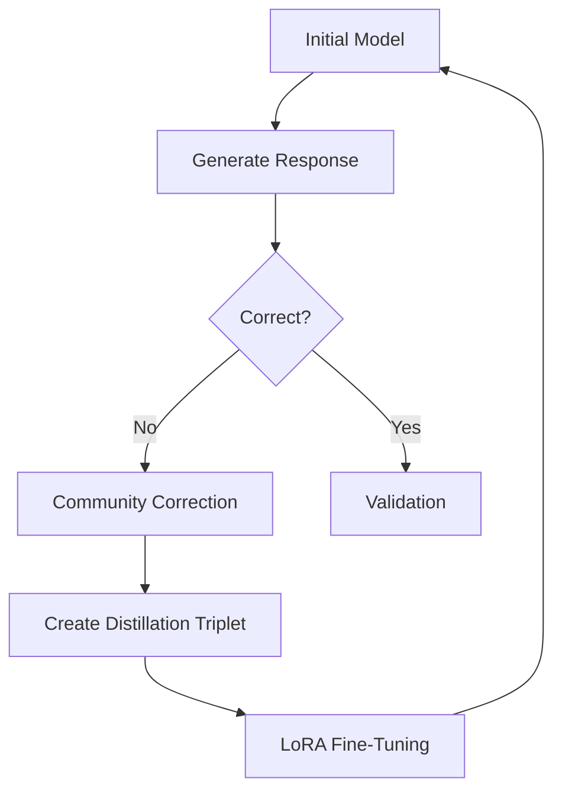

# From Whispers to Voices: A "Community-In-The-Loop" Proposal for Model Distillation and Language Preservation

A working model of the Stoney Nakoda language has been developed and is now available for community-in-the-loop testing in 2025:

- **Model App**: [Stoney Language Model App](https://huggingface.co/spaces/HarleyCooper/StoneyApp)  
- **Training Data**: [StoneyNakoda Training Dataset](https://huggingface.co/datasets/HarleyCooper/StoneyNakoda/blob/main/zSTONEY1_TRAINING_SET.jsonl)

Any First Nations community seeking to apply this approach to their own language is warmly invited to reach out.

By following this code, you can build a model for any low-resource language. The starting dictionary—minimum ~8,000 words—remains critical.

---

## Table of Contents

1. [Introduction](#Introduction)  
2. [Project Architecture](#project-architecture)  
   - [High-Level System Design](#high-level-system-design)  
   - [Data Flow](#data-flow)  
3. [Detailed Project Structure](#detailed-project-structure)  
4. [Core Components](#core-components)  
5. [Comprehensive Setup Instructions](#comprehensive-setup-instructions)  
6. [Detailed Usage Pipeline](#detailed-usage-pipeline)  
   1. [Generate Training Data](#1-generate-training-data)  
   2. [Prepare Fine-tuning Data](#2-prepare-fine-tuning-data)  
   3. [Fine-tune Model](#3-fine-tune-model)  
7. [Advanced Model Configuration](#advanced-model-configuration)  
   - [OpenAI Models](#openai-models)  
   - [Google Gemini](#google-gemini)  
   - [Hyperparameters](#hyperparameters)  
8. [Comprehensive Data Formats](#comprehensive-data-formats)  
   - [Dictionary Format](#dictionary-format)  
   - [Q&A Format](#qa-format)  
   - [OpenAI Training Format](#openai-training-format)  
9. [Development Guidelines](#development-guidelines)  
10. [Contributing](#contributing)  
11. [License](#license)  
12. [Acknowledgments](#acknowledgments)  
13. [The Community-in-the-Loop Revolution](#the-community-in-the-loop-revolution)  
    - [Introduction](#introduction)  
    - [Conceptual Overview](#conceptual-overview)  
    - [Heart of the Approach](#heart-of-the-approach)  
    - [LoRA Fine-Tuning](#lora-fine-tuning)  
    - [Mathematical Foundations](#mathematical-foundations)  
    - [Mermaid Diagram](#mermaid-diagram)  
    - [Cultural Integrity](#cultural-integrity)  
    - [Data Sources](#data-sources)  
    - [Expanding the Concept](#expanding-the-concept)  
    - [Adaptive Checkpoints](#adaptive-checkpoints)  
    - [Example Workflow](#example-workflow)  
    - [Monitoring & QA](#monitoring--qa)  
    - [Future Directions](#future-directions)  
    - [Glossary](#glossary)  

---

## Introduction

In my office, there is a murder; a map of one, at least.  


George Mercer Dawson explored the Bow Valley in the late 1800s, noting language on the British Columbia side. His map, though richly colored, stands like a tombstone over the Bow Valley where the Stoney people lived:


Nearby languages blend like “linguistic DNA,” and machine learning could help trace faint threads of lost speech to their roots. Where some see isolation as a curse, in the age of AI, Stoney’s uniqueness is its strength.

For about two years, I considered how a model could self-train on a set of 100% indigenous data, refining its grasp of the broader Stoney Language. Two key releases influenced this:

1. [Meta’s Llama-3 Model (April 18th, 2024)](https://www.reuters.com/technology/meta-releases-early-versions-its-llama-3-ai-model-2024-04-18/)  
2. [OpenAI Fine-Tuning API (October 2024)](https://openai.com/index/api-model-distillation/)

Both gave me the push to build what’s presented here. The true innovation lies in how communities create dictionaries and then fine-tune each model iteration. Textbooks that the Stoney community created—intended as educational tools—became perfect model prompts, each chapter or word offering pure indigenous data devoid of external biases.

Early in 2024, a sketch by James Hector shifted my thinking from the Stoney “People” to a single Stoney “Woman” who saw these same mountains and rivers from a fading context. It inspired a final push to ensure the Community-In-The-Loop concept became a reality.

A hundred years from now, strangers will live in our homes, and most of what we fret over won’t matter. As we fade, let’s remember “Stoney Woman” and every chance we have to preserve her language.  
**I am available to help any nation with the code.**

---

## Project Architecture

This code forms a complete pipeline for training and deploying a Stoney model. It is fully functional—but not correct 100% of the time—and is designed to improve through Community-In-The-Loop feedback. Access the model here:  
[Stoney Language Model App](https://huggingface.co/spaces/HarleyCooper/StoneyApp)

### High-Level System Design

1. **Data Ingestion Layer**  
2. **Processing Pipeline** (Q&A generation, augmentation, conversion)  
3. **Model Training Framework** (fine-tuning, hyperparameters, monitoring)  
4. **Inference Interface** (API endpoint, response formatting, error handling)

### Data Flow

1. Raw dictionary data → Data Ingestion  
2. Processed data → Q&A Generation  
3. Generated Q&A pairs → Training Data Preparation  
4. Prepared data → Model Fine-tuning  
5. Fine-tuned model → Inference Interface  

---

## Detailed Project Structure


```

PUBLICRELEASE/ ├── OpenAIFineTune/ # OpenAI fine-tuning files │ ├── stoney_train.jsonl # Training dataset │ └── stoney_valid.jsonl # Validation dataset ├── checkpoints/ # Model checkpoints ├── .env.example # Env variables example ├── requirements.txt # Python dependencies ├── english_dictionary.jsonl ├── stoney_dictionary.jsonl └── bilingual_training_set.jsonl

```

---

## Core Components

### Data Generation & Processing

- **`bilingual_qa_generator.py`**  
  Generates Q&A pairs from dictionaries, using advanced language generation.

- **`convert_data_format.py`**  
  Supports multiple data formats; validates and enforces schemas.

- **`finetunesetup.py`**  
  Splits data (80/20) with stratified sampling and prepares files.

### Model Training

- **`openai_finetune.py`**  
  Handles fine-tuning, error handling, checkpointing, and logging.

---

## Comprehensive Setup Instructions

### System Requirements

- Python 3.8+  
- 8GB+ RAM (16GB recommended)  
- 10GB free disk space  
- Stable internet connection  

### Environment Setup

```bash
# Clone the repository
git clone [repository-url]
cd PUBLICRELEASE

# Create and activate a virtual environment
python -m venv venv
source venv/bin/activate  # Windows: venv\Scripts\activate

# Install dependencies
pip install -r requirements.txt

```

### Configuration

```bash
# Copy example environment file
cp .env.example .env
# Provide OPENAI_API_KEY, GOOGLE_API_KEY in .env

```

### Initialization

```bash
python initialize.py

```

----------

## Detailed Usage Pipeline

### 1. Generate Training Data

```bash
python bilingual_qa_generator.py

```

-   Processes `english_dictionary.jsonl` & `stoney_dictionary.jsonl`
-   Produces `bilingual_training_set.jsonl`

### 2. Prepare Fine-tuning Data

```bash
python finetunesetup.py

```

-   Converts Q&A to OpenAI format
-   Outputs `OpenAIFineTune/stoney_train.jsonl` & `stoney_valid.jsonl`

### 3. Fine-tune Model

```bash
python openai_finetune.py

```

-   Uploads files to OpenAI
-   Monitors fine-tuning progress
-   Implements checkpointing & logs

----------

## Advanced Model Configuration

### OpenAI Models

-   Default: `gpt-4o-2024-08-06`
-   Alternative: `gpt-3.5-turbo`
-   `.env`: `OPENAI_MODEL`

### Google Gemini

-   Default: `gemini-2.0-exp`
-   `.env`: `GEMINI_MODEL`

### Hyperparameters

-   LR: `1e-5`
-   Batch size: `32`
-   Epochs: `3`
-   Context window: `4096`

----------

## Comprehensive Data Formats

### Dictionary Format

```json
{
  "english_word": "example",
  "stoney_versions": [
    {
      "word": "...",
      "grammatical_classification": "...",
      "meaning": "..."
    }
  ]
}

```

### Q&A Format

```json
{
  "question": "How do you say X in Stoney?",
  "answer": "The Stoney word for X is...",
  "source_language": "english",
  "generated_at": "timestamp"
}

```

### OpenAI Training Format

```json
{
  "messages": [
    {"role": "system", "content": "You are a bilingual Stoney-English assistant..."},
    {"role": "user", "content": "question"},
    {"role": "assistant", "content": "answer"}
  ]
}

```

----------

## Development Guidelines

-   **Style**: PEP 8, type hints, docstrings, consistent naming
-   **Testing**: Unit tests, integration tests, CI, coverage
-   **Documentation**: Inline comments, usage examples, troubleshooting

----------

## Contributing

1.  Fork, branch, implement changes, test
2.  Submit a pull request

**Code Review**

-   Clear commits, small changes, documentation, test coverage

----------

## License

Project licensed under [LICENSE]; see LICENSE file.

----------

## Acknowledgments

-   **Stoney Nakoda First Nation**: Language expertise
-   **OpenAI & Google**: AI model support
-   **Contributors & Advisors**

----------

## The Community-in-the-Loop Revolution

### Introduction

We aim to preserve, refine, and resurrect endangered languages via AI. Minimal lexical data can evolve into a culturally rich digital speaker of Stoney Nakoda. This subverts assumptions that massive datasets are necessary, instead emphasizing:

-   Iterative improvement with community feedback
-   Narrative corrections (cultural context over simple dictionary entries)
-   Low-Rank Adaptation (LoRA) for parameter-efficient fine-tuning

### Conceptual Overview

**Community-in-the-Loop Model Distillation**:

1.  Start with a small dictionary/text set.
2.  Prompt an initial model.
3.  Let the community correct errors with storytelling and context, not just words.
4.  LoRA-based fine-tuning absorbs these narrative corrections.
5.  The model evolves iteratively, guided by cultural custodians.

### Heart of the Approach

-   **Intentional Errors**: Poke the model with tough or context-specific queries.
-   **Narrative Corrections**: Rich cultural commentary instead of bare “right vs. wrong.”
-   **Distillation Triplets**: (Prompt, Disallowed Reply, Narrative Reply).
-   **Iterative Improvement**: If the model stumbles, revert and add more context.

### LoRA Fine-Tuning

LoRA attaches small, low-rank matrices to the base model. This dramatically reduces compute and speeds up retraining:

-   **Efficiency**: Fraction of resources required vs. full retraining
-   **Focused Updates**: Capturing the “essence” of new knowledge
-   **Rapid Iterations**: Frequent refinement without heavy overhead

### Mathematical Foundations

If W0\mathbf{W}_0 is the base weight matrix, LoRA introduces ΔW=AB\Delta \mathbf{W} = \mathbf{A}\mathbf{B} with A∈Rd×r\mathbf{A} \in \mathbb{R}^{d \times r} and B∈Rr×k\mathbf{B} \in \mathbb{R}^{r \times k}, where r≪min⁡(d,k)r \ll \min(d,k). Loss functions track both linguistic and cultural accuracy (e.g., a “Cultural Authenticity Score”).

### Mermaid Diagram



### Cultural Integrity

Every correction preserves cultural norms—idioms, humor, oral traditions—and ensures the community wields control over the AI’s “mindset.”

### Data Sources

A 10,000-word Stoney Nakoda dictionary and community textbooks serve as seeds. Community feedback enriches this data over time, weaving historical memory into the model.

### Expanding the Concept

From a tiny dictionary to an AI that:

-   **Understands context** (formal/informal usage)
-   **Integrates cultural references** (stories, metaphors)
-   **Remembers history** (ancestors, ceremonies, seasonal events)

### Adaptive Checkpoints

-   **Forward Progress**: Keep the new checkpoint if improved.
-   **Reversion**: If degraded, roll back and increase context in corrections.
-   **Convergence**: Repeat until stable authenticity and fluency metrics are met.

### Example Workflow

1.  **Prompt**: “How to say ‘taste slightly with the tip of your tongue’ in Stoney?”
2.  **Model’s Flawed Reply**: “`supthîyach`” (incorrect).
3.  **Community Correction**: Shares the correct phrase plus a story from childhood.
4.  **Distillation Triplet**: (Prompt, Disallowed, Narrative).
5.  **LoRA Fine-Tuning**: Model adjusts swiftly.
6.  **Re-Evaluation**: Answers improve in subsequent queries.

### Monitoring & QA

-   **Cultural Authenticity Score (CAS)**
-   **Linguistic Fluency** (perplexity, cross-entropy)
-   **Validation Loops** (watch for regressions, revert if needed)

### Future Directions

-   **Oral Histories**: Model retells century-old stories.
-   **Seasonal Knowledge**: Terms tied to ceremonies and ecological cycles.
-   **Dialects/Accents**: Respecting sub-regional differences.
-   **Educational Tools**: Interactive AI for language learning.
-   **Ethical AI**: Centered on consent, community governance, cultural integrity.

### Glossary

-   **CAS**: Cultural Authenticity Score
-   **Distillation Triplet**: (Prompt, Flawed Reply, Narrative Reply)
-   **LoRA**: Low-Rank Adaptation
-   **Community-in-the-Loop**: Paradigm of continuous human-guided refinement


**Think about Stoney Woman**—her view of the rivers and mountains—and about any First Nations community that could benefit from preserving its language through this approach. **I am available to help any nation with the code.**

