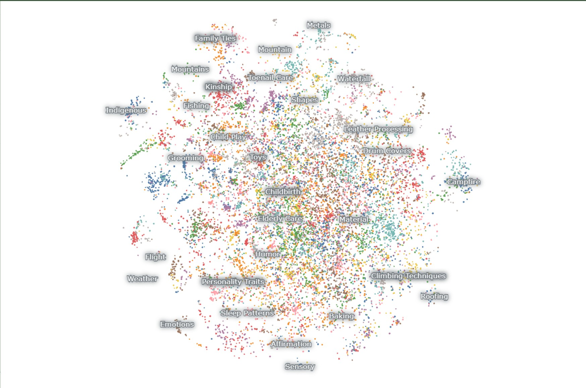
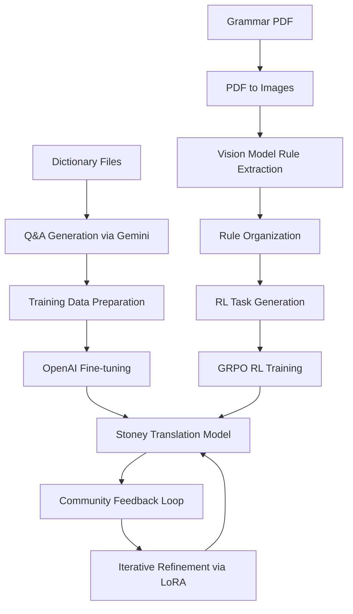
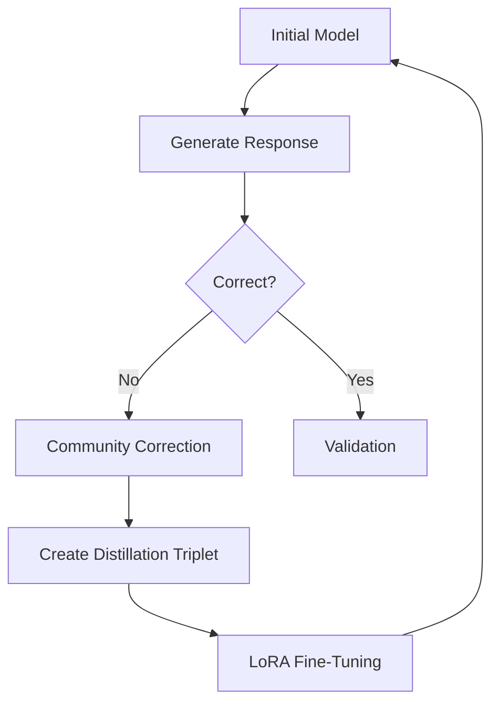

# From Whispers to Voices: A "Community-In-The-Loop" Proposal for Model Distillation and Language Preservation

A working model of the Stoney Nakoda language has been developed and is now available for community-in-the-loop testing in 2025:

- **Model App**: [Stoney Language Model App](https://huggingface.co/spaces/HarleyCooper/StoneyApp)  
- **Training Data**: [StoneyNakoda Training Dataset](https://huggingface.co/datasets/HarleyCooper/StoneyNakoda/blob/main/zSTONEY1_TRAINING_SET.jsonl)


Any First Nations community seeking to apply this approach to their own language is warmly invited to reach out. 

By following this code, you can build a model for any low-resource language. The starting dictionary size should be ~8,000 words.

---

<div align="center">
  <a href="https://huggingface.co/spaces/HarleyCooper/AskAboutCIL" target="_blank">
    
  </a>
</div>

---

## Table of Contents

1. [New Years Day, Canadian Rockies, 2025](#introduction)  
2. [Understanding How AI Learns Stoney Words Using Cosine Similarity](#understanding-how-ai-learns-stoney-words-using-cosine-similarity)
3. [Project Architecture](#project-architecture)  
   - [High-Level System Design](#high-level-system-design)  
   - [Data Flow](#data-flow)  
4. [Detailed Project Structure](#detailed-project-structure)  
5. [Core Components](#core-components)  
   - [Data Generation & Processing](#data-generation--processing)
   - [Model Training](#model-training)
6. [Comprehensive Setup Instructions](#comprehensive-setup-instructions)  
   - [System Requirements](#system-requirements)
   - [Environment Setup](#environment-setup)
   - [Configuration](#configuration)
   - [Initialization](#initialization)
7. [Detailed Usage Pipeline](#detailed-usage-pipeline)  
   1. [Generate Training Data](#1-generate-training-data)  
   2. [Prepare Fine-tuning Data](#2-prepare-fine-tuning-data)  
   3. [Fine-tune Model](#3-fine-tune-model)  
8. [Advanced Model Configuration](#advanced-model-configuration)  
   - [OpenAI Models](#openai-models)  
   - [Google Gemini](#google-gemini)  
   - [Hyperparameters](#hyperparameters)  
9. [Comprehensive Data Formats](#comprehensive-data-formats)  
   - [Dictionary Format](#dictionary-format)  
   - [Q&A Format](#qa-format)  
   - [OpenAI Training Format](#openai-training-format)  
10. [Development Guidelines](#development-guidelines)  
11. [Contributing](#contributing)  
12. [License](#license)  
13. [Acknowledgments](#acknowledgments)  
14. [The Community-in-the-Loop Revolution](#the-community-in-the-loop-revolution)  
    - [Introduction](#introduction-1)  
    - [Conceptual Overview](#conceptual-overview)  
    - [Heart of the Approach](#heart-of-the-approach)  
    - [LoRA Fine-Tuning](#lora-fine-tuning)  
    - [Mathematical Foundations](#mathematical-foundations)  
    - [Mermaid Diagram](#mermaid-diagram)  
    - [Cultural Integrity](#cultural-integrity)  
    - [Data Sources](#data-sources)  
    - [Expanding the Concept](#expanding-the-concept)  
    - [Adaptive Checkpoints](#adaptive-checkpoints)  
    - [Example Workflow](#example-workflow)  
    - [Monitoring & QA](#monitoring--qa)  
    - [Future Directions](#future-directions)  
    - [Glossary](#glossary)  
15. [March 2025 RL Update](#march-2025-rl-update)
    - [Adapting Verifiers for Low-Resource Language Translation](#adapting-verifiers-for-low-resource-language-translation)
    - [Overview](#overview)
    - [Key Concepts](#key-concepts)
    - [Code Structure and Components](#code-structure-and-components)
    - [Adapting to Your Specific Low-Resource Task](#adapting-to-your-specific-low-resource-task)
    - [Generating Reward Functions from Language Patterns](#generating-reward-functions-from-language-patterns)
16. [StoneyNakoda 42K Dictionary](#stoney-nakoda-42k-dictionary)
17. [October 2025 Grammar Gym Expansion](#october-2025-grammar-gym-expansion)
    - [Closed-Loop Pipeline Overview](#closed-loop-pipeline-overview)
    - [Grammar Rule Construction and Traceability](#grammar-rule-construction-and-traceability)
    - [Multi-Signal Reward Stack](#multi-signal-reward-stack)
    - [Qualitative RL for Cultural Competence](#qualitative-rl-for-cultural-competence)
    - [Operational Checklist](#operational-checklist)
    - [Research Outlook](#research-outlook)

---

## Introduction

New Years Day, 2025


In my office, there is a murder; a map of one, at least.  


George Mercer Dawson explored the Bow Valley in the late 1800s as a geologist but also as a linguist, noting language on the British Columbia side. His map, though richly colored, stands like a tombstone over the Bow Valley where the Stoney people lived because he made no notes on their language and simply noted the people as "recent immigrants". Much of this work was based on the notes of W. Faser Tolmie and was published after his death. 


What is very obvious from the linguistic patterns among the Haida, Tshimsia, Thlinkit, Kwakiool and Kawitshin dialects nearby is that languages blend like "linguistic DNA," and machine learning could help trace faint threads of lost speech to their roots. Where some see isolation as a curse, in the age of AI, Stoney's isolation turns out to be its strength.

For about two years, I thought about the size of the vector space that would be needed to get a model to self-train on a set of 100% indigenous data, and how that model could refine its grasp of the broader Stoney Language. This is now publicly and freely available. 


Two key releases influenced my thinking of what was possible:

1. [Meta's Llama-3 Model (April 18th, 2024)](https://www.reuters.com/technology/meta-releases-early-versions-its-llama-3-ai-model-2024-04-18/)  
2. [OpenAI Fine-Tuning API (October 2024)](https://openai.com/index/api-model-distillation/)

Both gave me the motivation to build what's presented here. The true innovation here lies in how communities can narratively correct the initially flawed response (about 10% of the time, the model works every time.) then that feeback be passed seamleslly back into the fine-tuning process. The [textbooks](https://globalnews.ca/news/9430501/stoney-nakota-language-textbook/) that the Stoney community createdΓÇöintended as educational toolsΓÇöbecame perfect concept of a model prompts, each chapter or word offering pure indigenous data devoid of external weights or biases to the fine-tuning process.


Early in 2023, I found an original, unpublished sketch by James Hector likely drawn in the summer of 1858 or 1859 along the Bow River in Southern Alberta:


Finding this, and already aware of George Mercer Dawson's work on First Nation's language on the British Columbia side, I was inspired to put the effort in and build a working model of the language and implement the Community-In-The-Loop distillation method.

This sketch shifted my thinking from considering the "Stoney People" to this "Stoney Woman" who saw these same mountains and rivers I see everyday, yet who had a very different way to think about and communicate to the world around her.  The Community-in-the-Loop model distillation will quickly converge this initial model toward fluencey. I suspect this will require the community to correct about 80,000 question and answer pairs and would cost less than $800 in OpenAI computing power. Recent releases by Google and the Chinese Lab DeepSeek, could effectively reduce the cost to zero.  

I think what this project has left me considering most is that a century from now, strangers will live in all our homes and most of what we worry about today will not matter. But we can honor "Stoney Woman" by making sure her language endures, forging a living record in an age of AI. Incredibly, this tool will work with any first nations language, as long as there is a starting dictionary of about 8,000 words. 

**I am freely available to help any First Nation in Canada.**

---

## Quick Start: Running the Complete Stoney Pipeline

### Prerequisites

```bash
# 1. Clone and navigate to repository
cd StoneyNakoda

# 2. Create virtual environment
python -m venv venv
source venv/bin/activate  # Windows: venv\Scripts\activate

# 3. Install dependencies
pip install -r requirements.txt

# 4. Configure API keys
cp .env.example .env
# Edit .env and add:
#   OPENAI_API_KEY=sk-...
#   GOOGLE_API_KEY=...
# Optional: HUGGINGFACE_TOKEN, WANDB_API_KEY for publishing/tracking
```

### Full Pipeline Execution

**Recommended Approach: Run Both Pipelines Sequentially**

**Phase 1: Dictionary→Fine-tuning (Supervised Learning)**

```bash
# Step 1: Generate 150K Q&A pairs from dictionaries (takes several hours)
python bilingual_qa_generator.py

# Step 2: Convert to OpenAI format and split train/validation
python finetunesetup.py

# Step 3: Fine-tune model via OpenAI API (monitor in console)
python openai_finetune.py
# This will output a fine-tuned model ID when complete
```

**Phase 2: Grammar→RL (Reinforcement Learning)**

```bash
# Step 4: Extract grammar rules from PDF and generate RL tasks
python run_stoney_grammar_pipeline.py

# Step 5: Install custom RL environment
pip install -e environments/stoney_nakoda_translation

# Step 6: Run GRPO training with your RL framework
# Use data/training_datasets_stoney.jsonl with prime-rl or similar
```

**Phase 3: Deploy and Iterate**

```bash
# Deploy your fine-tuned model to HuggingFace Spaces or API
# Collect community feedback
# Create distillation triplets (Prompt, Wrong Answer, Narrative Correction)
# Re-train with LoRA on correction data
```

### Quick Pipeline Options

**Option A: Dictionary Pipeline Only** (Fastest path to working model)
```bash
python bilingual_qa_generator.py && python finetunesetup.py && python openai_finetune.py
```

**Option B: Grammar RL Pipeline Only** (For grammatical precision)
```bash
python run_stoney_grammar_pipeline.py && pip install -e environments/stoney_nakoda_translation
```

### Expected Outputs

After running both pipelines, you'll have:

- `OpenAIFineTune/stoney_train.jsonl` & `stoney_valid.jsonl` (supervised training data)
- Fine-tuned OpenAI model ID (from console output)
- `data/rl_training_rules_stoney.json` (curated grammar rules)
- `data/training_datasets_stoney.jsonl` (RL training tasks)
- Custom RL environment installed and ready for GRPO training

### Monitoring Progress

- **Dictionary Pipeline**: Watch `tqdm` progress bars, check `Dictionaries/checkpoints/` for recovery points
- **Fine-tuning**: Monitor OpenAI dashboard or W&B if configured
- **Grammar Pipeline**: Check `data/grammar_extracted_stoney/*.json` for rule extraction quality

### Cost Estimates

- **Google Gemini API**: ~$5-15 for 150K Q&A generation (depends on model)
- **OpenAI Fine-tuning**: ~$20-50 for GPT-4o-mini with 3 epochs
- **Grammar Extraction**: ~$10-30 for vision model PDF processing
- **Total**: ~$35-95 for complete pipeline

---

## Understanding How AI Learns Stoney Words Using Cosine Similarity

Word Embeddings: Mapping Words in Space
Word embeddings are like placing words in a high-dimensional map, where similar words are positioned closer together. For example, "strawberry," "orange," and "cherry" might form a cluster because they are fruits, while "laptop," "Microsoft," and "Android" might cluster elsewhere as tech-related terms. Each axis in this space represents a characteristic of the words, such as their context or meaning.

Context Shapes Meaning
A word's position in this space isn't fixedΓÇöit shifts based on context. For instance, the word "apple" could mean a fruit or the tech brand, depending on its surrounding words, like "buy" (tech) or "tree" (fruit). This dynamic placement captures the nuances of meaning.

Cosine Similarity: Measuring Relationships
Cosine similarity quantifies how similar two words are by measuring the angle between their vectors in the embedding space:

- Similar words have vectors pointing in nearly the same direction (cosine similarity close to 1)
- Unrelated words have vectors at a right angle (cosine similarity near 0)
- Opposite meanings have vectors pointing in opposite directions (cosine similarity close to -1)
- For example, "cherry" and "orange" might have a similarity of 0.97, while "cherry" and "laptop" might score 0.24

How AI Learns Stoney Words

- **Stoney Dictionary as a Starting Point:**
  The AI begins with a structured dictionary of Stoney words, including translations, categories, pronunciations, and cultural context.

- **Community Feedback for Learning:**
  The AI makes initial translations, which are often incorrect. Stoney speakers provide corrections, enriched with cultural context, stories, and humor. This feedback helps refine the AI's understanding.

The Role of Cosine Similarity in AI Learning

- The AI uses word embeddings to group Stoney words based on their meaning. For example, it determines whether a word belongs to a category like "fruit," "animal," or "spiritual."
- Community corrections and cosine similarity guide the AI in repositioning words closer to their accurate groupings in the embedding space.

Iterative Refinement
Through repeated feedback and fine-tuning, the AI improves its ability to place Stoney words correctly, not just individually but in the context of sentences and paragraphs. Over time, it develops a detailed, dynamic map of the Stoney language, with words clustered according to their community-informed meanings and uses.

Although this is not cosine similarity, you can see the relationships among words can concepts in Stoney as I have mapped them here:

[](https://atlas.nomic.ai/data/harleycoops/stoney-1/map/8049523d-b620-4da3-962c-c509e08f586f#iE2b)

### StoneyNakoda 42K Dictionary
[](https://atlas.nomic.ai/data/harleycoops/stoney-nakoda-language-synthetic/map/5c87caaf-6be0-4546-9e83-826569070b24#VyjE)

---

## Project Architecture

This code forms a complete **dual-pipeline system** for training and deploying Stoney models. Both pipelines are fully functional and designed to improve through Community-In-The-Loop feedback. Access the active model here:  
[Stoney Language Model App](https://huggingface.co/spaces/HarleyCooper/StoneyApp)

### Dual Pipeline Architecture (October 2025)

The project now contains **two complementary training pathways**:

**1. Dictionary→Fine-tuning Pipeline (Supervised Learning)**
- Primary path for building conversational translation models
- Uses dictionary data to generate diverse Q&A pairs via Google Gemini
- Fine-tunes OpenAI models (GPT-4o-mini/GPT-4) for natural language fluency
- **Best for**: Initial model deployment, general translation capability

**2. Grammar→RL Pipeline (Reinforcement Learning)** **[October 2025 Addition]**
- Extracts structured grammar rules from PDF scans using vision models
- Generates verifiable RL training tasks with multi-signal rewards
- Uses GRPO (Group Relative Policy Optimization) for precise linguistic tuning
- **Best for**: Grammatical accuracy, morphology, cultural competence

### High-Level System Design

**Dictionary Pipeline:**
1. **Data Ingestion Layer** (JSONL dictionaries)
2. **Processing Pipeline** (Q&A generation via Gemini, format conversion)
3. **Model Training Framework** (OpenAI fine-tuning, hyperparameters, monitoring)
4. **Inference Interface** (HuggingFace deployment, API endpoint)

**Grammar Pipeline:**
1. **PDF Ingestion** (Grammar textbook → page images)
2. **Vision Extraction** (OpenAI vision models → structured rules)
3. **Task Generation** (Rules → RL training tasks with hints/verification)
4. **RL Training** (GRPO with multi-faceted reward functions)

### Combined Data Flow



---

## Detailed Project Structure

```
StoneyNakoda/
├── Dictionaries/                          # Source dictionary files
│   ├── english_dictionary.jsonl           # English→Stoney mappings
│   ├── stoney_dictionary.jsonl            # Stoney→English mappings
│   └── bilingual_training_set.jsonl       # Generated Q&A pairs
├── OpenAIFineTune/                        # Training files for OpenAI
│   ├── stoney_train.jsonl                 # 80% training split
│   └── stoney_valid.jsonl                 # 20% validation split
├── data/                                  # RL pipeline outputs
│   ├── grammar_pages/                     # Rendered PDF pages (PNG)
│   ├── grammar_extracted_stoney/          # Raw rule extractions (JSON)
│   ├── rl_training_rules_stoney.json      # Curated grammar rules
│   └── training_datasets_stoney.jsonl     # RL training tasks
├── environments/                          # Custom RL environments
│   └── stoney_nakoda_translation/         # Stoney RL environment package
├── stoney_rl_grammar/                     # Grammar RL pipeline module
│   ├── pipeline.py                        # High-level orchestration
│   ├── pdf_ingest.py                      # PDF→image conversion
│   ├── rule_extractor.py                  # Vision-based rule extraction
│   ├── rule_organizer.py                  # Rule curation and filtering
│   ├── task_generator.py                  # RL task generation
│   ├── config.py                          # Configuration and paths
│   └── models.py                          # Data models (GrammarRule, etc.)
├── Public/                                # Images and documentation assets
├── bilingual_qa_generator.py              # Q&A generation via Gemini
├── finetunesetup.py                       # Data formatting and splitting
├── openai_finetune.py                     # OpenAI fine-tuning + HF + W&B
├── convert_data_format.py                 # Legacy format converter
├── run_stoney_grammar_pipeline.py         # CLI entry for grammar RL pipeline
├── requirements.txt                       # Python dependencies
├── .env.example                           # API key template
├── RLHFrules.json                         # Language pattern rules for RL
├── Stoney; A Grammar of the Stony Language.pdf  # Source grammar PDF
├── CLAUDE.md                              # Developer guide for Claude Code
├── PIPELINE_GUIDE.md                      # Complete execution guide
└── README.md                              # Full project documentation
```

---

## Core Components

### Data Generation & Processing

- **`bilingual_qa_generator.py`**  
  Generates Q&A pairs from dictionaries, using advanced language generation.

- **`convert_data_format.py`**  
  Supports multiple data formats; validates and enforces schemas.

- **`finetunesetup.py`**  
  Splits data (80/20) with stratified sampling and prepares files.

### Model Training

- **`openai_finetune.py`**  
  Handles fine-tuning, error handling, checkpointing, and logging.

---

## Comprehensive Setup Instructions

### System Requirements

- Python 3.8+  
- 8GB+ RAM (16GB recommended)  
- 10GB free disk space  
- Stable internet connection  

### Environment Setup

```bash
# Clone the repository
git clone [repository-url]
cd PUBLICRELEASE

# Create and activate a virtual environment
python -m venv venv
source venv/bin/activate  # Windows: venv\Scripts\activate

# Install dependencies
pip install -r requirements.txt

```

### Configuration

```bash
# Copy example environment file
cp .env.example .env
# Provide OPENAI_API_KEY and GOOGLE_API_KEY in .env
# Add HUGGINGFACE_* keys to auto-publish datasets and WANDB_* keys for training telemetry (see notes below)
# Optionally set OPENAI_RESPONSES_MODEL / STONEY_*_MODEL overrides if you want a different Responses API model
# (see https://platform.openai.com/docs/guides/migrate-to-responses for the latest guidance)

```

-   Set `HUGGINGFACE_TOKEN`, `HUGGINGFACE_DATASET_REPO`, and (optionally) `HUGGINGFACE_DATASET_PRIVATE` to push the fine-tuning JSONL files to Hugging Face Datasets automatically.
-   Set `WANDB_API_KEY`, `WANDB_PROJECT`, and (optionally) `WANDB_ENTITY` / `WANDB_RUN_NAME` to stream OpenAI fine-tuning telemetry to Weights & Biases.

### Initialization

```bash
python initialize.py

```

----------

## Detailed Usage Pipeline

The project supports **two independent pipelines** that can be run separately or combined:

### Option A: Dictionary→Fine-tuning Pipeline (Recommended First)

**Step 1: Generate Training Data**

```bash
python bilingual_qa_generator.py
```

-   Processes `Dictionaries/english_dictionary.jsonl` & `Dictionaries/stoney_dictionary.jsonl`
-   Uses Google Gemini to generate 150,000 Q&A pairs (75K per language)
-   Produces `Dictionaries/bilingual_training_set.jsonl`
-   Creates checkpoints every 1000 pairs in `Dictionaries/checkpoints/`

**Step 2: Prepare Fine-tuning Data**

```bash
python finetunesetup.py
```

-   Converts Q&A pairs to OpenAI messages format
-   Applies 80/20 train/validation split
-   Outputs `OpenAIFineTune/stoney_train.jsonl` & `OpenAIFineTune/stoney_valid.jsonl`

**Step 3: Fine-tune Model**

```bash
python openai_finetune.py
```

-   Publishes dataset to Hugging Face when `HUGGINGFACE_*` variables are configured
-   Uploads files to OpenAI and starts fine-tuning job (default: GPT-4o-mini, 3 epochs)
-   Streams status and metrics to Weights & Biases when `WANDB_*` variables are provided
-   Monitors job progress and logs trained tokens, accuracy, validation loss
-   Returns fine-tuned model ID upon completion

### Option B: Grammar→RL Pipeline (October 2025)

**Run Complete Grammar Extraction Pipeline**

```bash
python run_stoney_grammar_pipeline.py
```

This executes the full 4-stage process:

1. **PDF Ingestion**: Renders `Stoney; A Grammar of the Stony Language.pdf` to PNG images
   - Output: `data/grammar_pages/*.png`

2. **Rule Extraction**: Uses OpenAI vision models to extract structured grammar rules
   - Output: `data/grammar_extracted_stoney/*.json`
   - Each extraction includes rule text, category, confidence score, page provenance

3. **Rule Organization**: Filters, deduplicates, and curates high-confidence rules
   - Output: `data/rl_training_rules_stoney.json`
   - Categories: morphology, syntax, phonology, translation, semantics, phonotactics

4. **Task Generation**: Converts rules into 3-6 RL training tasks per rule
   - Output: `data/training_datasets_stoney.jsonl`
   - Includes prompts, expected answers, hints, verification patterns, difficulty levels

**Install Custom RL Environment**

```bash
pip install -e environments/stoney_nakoda_translation
```

The environment provides:
- Multi-signal reward functions (exact match, character F1, pattern matching)
- Integration with GRPO and `verifiers` framework
- Support for qualitative, non-coding language tasks

**Run RL Training** (with your RL framework, e.g., Prime-RL)

```bash
# Use the generated data/training_datasets_stoney.jsonl with your GRPO trainer
# The custom environment exposes reward functions for linguistic accuracy
```

### Option C: Combined Approach (Recommended for Best Results)

1. **Run Dictionary Pipeline first** → Establishes base translation capability
2. **Deploy initial model** → Get community feedback
3. **Run Grammar Pipeline** → Add grammatical precision and cultural nuance
4. **Iterate with Community-In-The-Loop** → Refine using LoRA on correction triplets

----------

## Advanced Model Configuration

### OpenAI Models

-   Default: `gpt-4o-2024-08-06`
-   Alternative: `gpt-3.5-turbo`
-   `.env`: `OPENAI_MODEL`

### Google Gemini

-   Default: `gemini-2.0-exp`
-   `.env`: `GEMINI_MODEL`

### Hyperparameters

-   LR: `1e-5`
-   Batch size: `32`
-   Epochs: `3`
-   Context window: `4096`

----------

## Comprehensive Data Formats

### Dictionary Format

```json
{
  "english_word": "example",
  "stoney_versions": [
    {
      "word": "...",
      "grammatical_classification": "...",
      "meaning": "..."
    }
  ]
}

```

### Q&A Format

```json
{
  "question": "How do you say X in Stoney?",
  "answer": "The Stoney word for X is...",
  "source_language": "english",
  "generated_at": "timestamp"
}

```

### OpenAI Training Format

```json
{
  "messages": [
    {"role": "system", "content": "You are a bilingual Stoney-English assistant..."},
    {"role": "user", "content": "question"},
    {"role": "assistant", "content": "answer"}
  ]
}

```

----------

## Development Guidelines

-   **Style**: PEP 8, type hints, docstrings, consistent naming
-   **Testing**: Unit tests, integration tests, CI, coverage
-   **Documentation**: Inline comments, usage examples, troubleshooting

----------

## Contributing

1.  Fork, branch, implement changes, test
2.  Submit a pull request

**Code Review**

-   Clear commits, small changes, documentation, test coverage

----------

## The Community-in-the-Loop Revolution

### Introduction

This project aims to preserve, refine, and resurrect endangered languages via AI fine-tuning and model distillation. Minimal lexical data can evolve into a culturally rich digital speaker of Stoney Nakoda. This subverts assumptions that massive datasets are necessary, instead emphasizing:

-   Iterative improvement with community feedback
-   Narrative corrections (cultural context over simple dictionary entries)
-   Low-Rank Adaptation (LoRA) for parameter-efficient fine-tuning

### Conceptual Overview

**Community-in-the-Loop Model Distillation**:

1.  Start with a small dictionary/text set.
2.  Prompt an initial model.
3.  Let the community correct errors with storytelling and context, not just words.
4.  LoRA-based fine-tuning absorbs these narrative corrections.
5.  The model evolves iteratively, guided by cultural custodians.

### Heart of the Approach

-   **Intentional Errors**: Poke the model with tough or context-specific queries.
-   **Narrative Corrections**: Rich cultural commentary instead of bare "right vs. wrong."
-   **Distillation Triplets**: (Prompt, Disallowed Reply, Narrative Reply).
-   **Iterative Improvement**: If the model stumbles, revert and add more context.

### LoRA Fine-Tuning

LoRA attaches small, low-rank matrices to the base model. This dramatically reduces compute and speeds up retraining:

-   **Efficiency**: Fraction of resources required vs. full retraining
-   **Focused Updates**: Capturing the "essence" of new knowledge
-   **Rapid Iterations**: Frequent refinement without heavy overhead

### Mathematical Foundations

<div align="center">
  
</div>

LoRA (Low-Rank Adaptation) works by decomposing weight updates into smaller matrices, dramatically reducing parameters while preserving learning capacity.

#### Core Principles

- **Weight Decomposition**: If $W_0 \in \mathbb{R}^{d \times k}$ is the pre-trained weight matrix, LoRA parameterizes the update as:
  
  $$\Delta W = AB$$
  
  Where $A \in \mathbb{R}^{d \times r}$ and $B \in \mathbb{R}^{r \times k}$, with rank $r \ll \min(d,k)$

- **Parameter Efficiency**: For a typical transformer layer where $d=k=4096$, using $r=16$ reduces parameters by 99.2%

- **Forward Pass Computation**:
  
  $$h = W_0x + \Delta Wx = W_0x + ABx$$

#### Cultural-Linguistic Loss Function

Our approach combines standard cross-entropy loss with a novel Cultural Authenticity Score (CAS):

$$\mathcal{L} = \alpha\mathcal{L}_{CE} + (1-\alpha)\mathcal{L}_{CAS}$$

Where:
- $\mathcal{L}_{CE}$ is cross-entropy loss measuring linguistic accuracy
- $\mathcal{L}_{CAS}$ is derived from community feedback ratings (1-5 scale)
- $\alpha$ balances linguistic precision with cultural authenticity (typically 0.7)

#### Adaptation Dynamics

The adaptation process creates a specialized subspace that captures Stoney-specific linguistic patterns while preserving the base model's general capabilities. This enables:

1. **Targeted Learning**: Focus on Stoney-specific knowledge without catastrophic forgetting
2. **Efficient Transfer**: Leverage pre-trained knowledge while adding cultural nuance
3. **Iterative Refinement**: Quick adaptation cycles based on community feedback

### Mermaid Diagram



### Cultural Integrity

Every correction preserves cultural normsΓÇöidioms, humor, oral traditionsΓÇöand ensures the community wields control over the AI's "mindset."

### Data Sources

A 10,000-word Stoney Nakoda dictionary and community textbooks serve as seeds. Community feedback enriches this data over time, weaving historical memory into the model.

### Expanding the Concept

From a tiny dictionary to an AI that:

-   **Understands context** (formal/informal usage)
-   **Integrates cultural references** (stories, metaphors)
-   **Remembers history** (ancestors, ceremonies, seasonal events)

### Adaptive Checkpoints

-   **Forward Progress**: Keep the new checkpoint if improved.
-   **Reversion**: If degraded, roll back and increase context in corrections.
-   **Convergence**: Repeat until stable authenticity and fluency metrics are met.

### Example Workflow

1.  **Prompt**: "How to say 'taste slightly with the tip of your tongue' in Stoney?"
2.  **Model's Flawed Reply**: "`supthîyach`" (incorrect).
3.  **Community Correction**: Shares the correct phrase plus a story from childhood.
4.  **Distillation Triplet**: (Prompt, Disallowed, Narrative).
5.  **LoRA Fine-Tuning**: Model adjusts swiftly.
6.  **Re-Evaluation**: Answers improve in subsequent queries.

### Monitoring & QA

-   **Cultural Authenticity Score (CAS)**
-   **Linguistic Fluency** (perplexity, cross-entropy)
-   **Validation Loops** (watch for regressions, revert if needed)

### Future Directions

-   **Oral Histories**: Model retells century-old stories.
-   **Seasonal Knowledge**: Terms tied to ceremonies and ecological cycles.
-   **Dialects/Accents**: Respecting sub-regional differences.
-   **Educational Tools**: Interactive AI for language learning.
-   **Ethical AI**: Centered on consent, community governance, cultural integrity.

### Glossary

-   **CAS**: Cultural Authenticity Score
-   **Distillation Triplet**: (Prompt, Flawed Reply, Narrative Reply)
-   **LoRA**: Low-Rank Adaptation
-   **Community-in-the-Loop**: Paradigm of continuous human-guided refinement

---

## March 2025 RL Update

# Adapting Verifiers for Low-Resource Language Translation

This document details how to adapt the `verifiers` framework, originally designed for verifiable environments like math and coding, to the task of low-resource language translation.  This approach focuses on providing nuanced, multi-faceted rewards, going beyond simple correct/incorrect evaluations.

## Overview

The core idea is to treat translation as a multi-step process (even if it's just a single-turn translation) where the model receives rewards for various aspects of translation quality.  This allows for partial credit and provides more informative training signals, particularly beneficial in low-resource settings where data scarcity is a major challenge.

We will be customizing the following components of the `verifiers` library:

*   **Environment:** A custom `TranslationEnv` to handle the interaction with the translation model (LLM).
*   **Parser:** A simplified `TranslationParser` to extract the translated text from the LLM's output.  We won't require strict XML formatting for this task.
*   **Rubric:**  A `TranslationRubric` containing several reward functions that evaluate different quality dimensions (letter accuracy, word accuracy, semantic similarity, and edit distance).
*   **Training:** Using the `GRPOEnvTrainer` with our custom components and a small, low-resource translation dataset.

## Key Concepts

*   **Ground Truth:** A parallel corpus of source and target language sentences.  Essential for calculating rewards.  In low-resource scenarios, this might be a small, curated dataset.
*   **Multi-faceted Reward:**  Instead of a single reward, we provide separate rewards for:
    *   **Letter Accuracy:**  Proportion of correctly translated letters.
    *   **Word Accuracy:** Proportion of correctly translated words (space-separated).
    *   **Semantic Similarity:**  Uses pre-trained sentence embeddings (Sentence-BERT) to measure how close the *meaning* of the translation is to the ground truth, even if the exact words differ.
    *   **Edit Distance Similarity.** Levenshtein distances.
*   **Iterative Refinement (Optional):**  The environment can be designed to support multiple turns, allowing the LLM to refine its translation based on feedback (hints).  This example shows a rudimentary character by character suggestion technique, although a better version might provide hints more sparingly based on confidence scores.
*   **Low-Resource Focus:**  The techniques are tailored for scenarios with limited training data. This involves using smaller, specialized translation models (rather than massive general-purpose LLMs) and careful hyperparameter tuning (particularly `beta` in GRPO).

## Code Structure and Components

The code consists of the following main parts, each described in detail below:

1.  **`TranslationParser`:** A class to extract the translation from the LLM's output string.
2.  **`TranslationEnv`:**  A class inheriting from `MultiStepEnv` (or a simplified version) that defines the interaction loop between the trainer and the LLM.
3.  **`TranslationRubric`:**  A class inheriting from `Rubric` that defines the reward functions.
4.  **Dataset Creation (`create_dummy_dataset`):**  A function to load or create your low-resource translation dataset.  *You will replace this with your own dataset loading logic.*
5.  **Model Loading (`get_model_and_tokenizer`):** Uses functions from `verifiers` to load a suitable pre-trained translation model.
6.  **Training Setup (`GRPOEnvTrainer`):**  Sets up and runs the training process.

### 1. `TranslationParser`

```python
from types import SimpleNamespace

class TranslationParser:
    def parse(self, text: str, strip: bool = True) -> Any:
        translation = text.strip()
        return SimpleNamespace(translation=translation)
```

This simplified parser extracts the raw translated text from the LLM's output. We are not requiring or enforcing XML formatting, keeping the interaction straightforward.

### 2. TranslationEnv

```python
import verifiers as vf
from verifiers.envs import MultiStepEnv
from verifiers.rubrics import Rubric  # Will be used later.
from datasets import Dataset
from typing import List, Dict, Any

def check_prefix(text: str, suggested: str):
    if len(suggested) < 1:
        return False
    return text.startswith(suggested[:len(text)])
    
class TranslationEnv(MultiStepEnv):
    def __init__(self, dataset, system_prompt, max_steps=3):
        super().__init__(system_prompt=system_prompt, max_steps=max_steps, mask_env_response=False)
        self.dataset = dataset
        self.rubric = None # Set during get_rubric

    def get_dataset(self, **kwargs):
        return self.dataset
    def get_eval_dataset(self, **kwargs: Any):
      return self.dataset  # You might want separate eval set.

    def get_rubric(self):
        if self.rubric is None:
          self.rubric = TranslationRubric() # instantiate later.
        return self.rubric

    def is_completed(self, messages, **kwargs):
       assistant_text = self.rubric.parser.parse(messages[-1]['content']).translation
        user_query = self.get_last_user_prompt(messages)
        ground_truth = self.dataset.filter(lambda x: x["prompt"][0]['content'] == user_query)
        for element in ground_truth:
            target = element['answer']

        return check_prefix(target, assistant_text)

    def get_last_user_prompt(self, messages):
        i = len(messages) -1
        while i > -1:
           if messages[i]['role'] == 'user':
               return messages[i]['content']
           i-= 1
        return None
     # Suggest letters sequentially
    def env_response(self, messages, **kwargs):
        assistant_text = self.rubric.parser.parse(messages[-1]['content']).translation
        user_query = self.get_last_user_prompt(messages)
        ground_truth = self.dataset.filter(lambda x: x["prompt"][0]['content'] == user_query)

        response = "Check your word beginnings:"
        for element in ground_truth:
          target = element['answer']
          for i in range(0, min(len(target), len(assistant_text))):
              if target[i] != assistant_text[i]:
                   response += f" Your next correct letter choice starts with {target[i]}"
        return {"role": "user", "content": response}
```

Key Functions:

__init__: Initializes the environment with the dataset and system prompt. mask_env_response is set to False so suggestions/hints appear.

get_dataset: Returns the training dataset.

get_eval_dataset: Gets eval dataset

get_rubric: Returns an instance of the TranslationRubric.

is_completed: Checks if translation matches target, to terminate an interaction. We use custom checking logic by suggesting prefix matching, enabling hints, and then do similarity comparisons.

env_response Uses basic sequential suggestion algorithm. It will guide completion letter-by-letter if LLM fails.

### 3. TranslationRubric

```python
from verifiers.rubrics import Rubric
from sentence_transformers import SentenceTransformer
import numpy as np
from typing import List, Dict

class TranslationRubric(Rubric):
    def __init__(self, embedding_model_name: str = 'all-MiniLM-L6-v2'):
        super().__init__()
        self.parser = TranslationParser()
        self.embedding_model = SentenceTransformer(embedding_model_name)
        self.reward_funcs = [
            self.letter_accuracy_reward_func,
            self.word_accuracy_reward_func,
            self.semantic_similarity_reward_func,
            self.levenshtein_distance_reward_func,
        ]

    def letter_accuracy_reward_func(self, completions, answer, **kwargs) -> List[float]:
        rewards = []
        for completion, target in zip(completions, answer):
            completion_text = self.parser.parse(completion[0]["content"]).translation
            target_text = target.strip()

            min_len = min(len(completion_text), len(target_text))
            correct_letters = sum(1 for c1, c2 in zip(completion_text, target_text) if c1 == c2)
            reward = correct_letters / max(len(target_text), 1)  # Avoid division by zero

            rewards.append(reward)
        return rewards

    def word_accuracy_reward_func(self, completions, answer, **kwargs) -> List[float]:
        rewards = []
        for completion, target in zip(completions, answer):
            completion_text = self.parser.parse(completion[0]["content"]).translation
            target_words = target.strip().split()
            completion_words = completion_text.split()

            correct_words = sum(1 for cw in completion_words if cw in target_words)
            reward = correct_words / max(len(target_words), 1)
            rewards.append(reward)
        return rewards

    def semantic_similarity_reward_func(self, completions, answer, **kwargs) -> List[float]:
      rewards = []
      for completion, target in zip(completions, answer):
          completion_text = self.parser.parse(completion[0]["content"]).translation
          target_text = target.strip()

          try:
              completion_embedding = self.embedding_model.encode(completion_text, convert_to_numpy=True)
              target_embedding = self.embedding_model.encode(target_text, convert_to_numpy=True)
              # Cosine similarity
              similarity = np.dot(completion_embedding, target_embedding) / (np.linalg.norm(completion_embedding) * np.linalg.norm(target_embedding))
              rewards.append(max(0, similarity))  # Clip to be >= 0
          except Exception as e:
            print("Error during semantic similarity", e)
            rewards.append(0.0)
      return rewards

    def levenshtein_distance_reward_func(self, completions, answer, **kwargs) -> List[float]:
        def levenshtein_distance(s1, s2):
          if len(s1) > len(s2):
            s1, s2 = s2, s1
          distances = range(len(s1) + 1)
          for i2, c2 in enumerate(s2):
            distances_ = [i2+1]
            for i1, c1 in enumerate(s1):
              if c1 == c2:
                  distances_.append(distances[i1])
              else:
                  distances_.append(1 + min((distances[i1], distances[i1 + 1], distances_[-1])))
            distances = distances_
          return distances[-1]

        rewards = []
        for completion, target in zip(completions, answer):
          completion_text = self.parser.parse(completion[0]["content"]).translation
          target_text = target.strip()
          distance = levenshtein_distance(completion_text, target_text)
          normalized_distance =  distance / max(len(completion_text), len(target_text), 1) # Avoid division by zero
          rewards.append(1.0 - normalized_distance)
        return rewards
```

Key Components:

__init__: Initializes the rubric with a TranslationParser and a Sentence-BERT model for semantic similarity calculations. You can change the embedding_model_name to use different pre-trained embeddings.

letter_accuracy_reward_func: Calculates the proportion of correct letters.

word_accuracy_reward_func: Calculates the proportion of correct words.

semantic_similarity_reward_func: Calculates the cosine similarity between the sentence embeddings of the generated translation and the ground truth.

levenshtein_distance_reward_func: Provides similarity based on edit distances

### 4. Dataset Creation (Loading Stoney Data)

**For Stoney Nakoda, use the actual generated dataset:**

```python
import json
from datasets import Dataset
from pathlib import Path

def load_stoney_dataset(jsonl_path="Dictionaries/bilingual_training_set.jsonl"):
    """Load the Stoney Nakoda Q&A dataset generated by bilingual_qa_generator.py"""
    data = []
    with open(jsonl_path, 'r', encoding='utf-8') as f:
        for line in f:
            entry = json.loads(line.strip())
            # Format matches the actual Stoney dataset structure
            data.append({
                'question': entry['question'],
                'answer': entry['answer'],
                'info': {
                    'source_language': entry.get('source_language', 'english'),
                    'pair_id': entry.get('pair_id', 0)
                }
            })
    return Dataset.from_list(data)

# Load the actual Stoney dataset
train_dataset = load_stoney_dataset()
```

**Example entries from the actual dataset:**

```json
{"question": "If a friend suddenly left you without a word, how would you say 'he abandoned me suddenly' in Stoney?", "answer": "You would say 'aktesî yeyach' to express 'he abandoned me suddenly'.", "source_language": "english", "pair_id": 1}
{"question": "Imagine a person is very weak and cannot stand up on their own. Which Stoney word describes their condition of 'not being able to hold oneself up'?", "answer": "The Stoney word that describes their condition is 'nîhâsîch'.", "source_language": "english", "pair_id": 2}
```

**The dataset uses "question" and "answer" fields** (not "prompt"), matching the format generated by `bilingual_qa_generator.py`.

### 5. Model Loading (get_model_and_tokenizer)

```python
import verifiers as vf

model_name = "Helsinki-NLP/opus-mt-en-fr"  # Example: English to French
model, tokenizer = vf.get_model_and_tokenizer(model_name)
```

This uses the verifiers utility functions to load a pre-trained translation model and its corresponding tokenizer. Choose a model appropriate for your language pair. Start with smaller models for efficiency, especially in a low-resource setting.

### 6. Training Setup (GRPOEnvTrainer)

```python
from verifiers.trainers.grpo_env_trainer import GRPOEnvTrainer

# Load the actual Stoney Nakoda dataset
train_dataset = load_stoney_dataset("Dictionaries/bilingual_training_set.jsonl")

# Split for evaluation (or load separate eval set)
split = train_dataset.train_test_split(test_size=0.1, seed=42)
train_dataset = split['train']
eval_dataset = split['test']

# Set up environment and rubric
vf_env = TranslationEnv(dataset=train_dataset, system_prompt="You are a Stoney Nakoda language expert.")
rubric = vf_env.get_rubric()  # Get the rubric *from* the environment

run_name = "translation_example"
# set training to be short
training_args = vf.get_default_grpo_config(run_name=run_name, num_gpus=8)
training_args.num_generations = 1 # reduce data
training_args.max_steps = 3       # Short training for illustration

trainer = GRPOEnvTrainer(
    model=model,
    tokenizer=tokenizer,
    env=vf_env,
    reward_funcs=rubric.reward_funcs,
    args=training_args,
    train_dataset=train_dataset,
   # eval_dataset=eval_dataset
)

trainer.train()
```

This part sets up the GRPOEnvTrainer with the custom environment, rubric, dataset, model, and tokenizer. Key parameters to consider tuning, especially in low-resource settings, are in training_args.

## Adapting to Your Specific Low-Resource Task

**For Stoney Nakoda:**
- Dataset is already generated via `bilingual_qa_generator.py` → `Dictionaries/bilingual_training_set.jsonl`
- Format: `{"question": "...", "answer": "...", "source_language": "...", "pair_id": ...}`
- Load using the `load_stoney_dataset()` function shown above

**For Other Low-Resource Languages:**
- Replace the JSONL file with your own Q&A pairs in the same format
- Model: Choose a suitable pre-trained translation model for your languages
- Adjust `TranslationEnv` and reward functions for your language-specific patterns
- Hyperparameters: Experiment with the GRPOConfig parameters. Start with a low learning rate and consider increasing beta (the KL divergence penalty) to prevent overfitting on a small dataset. A larger beta keeps the model's weights closer to the pre-trained values.

## Generating Reward Functions from Language Patterns

One idea I have for generating a series of reward functions on a low resource language is to simply pass the JSON dictionary of the Stoney Nakoda, and ask for the rules or patterns the LLM notices. 

It will give you a full set of rules that you can then use to define a very large number of very small reward functions that can be used to very precisely fine tune even low resource languages around contours. 

Here is the actual LLM output using this simple idea: [RLHFrules.json](RLHFrules.json)

### Stoney Grammar RL Pipeline (October 2025 Refresh)

The RL Grammar Gym workflow now lives in this repo with Stoney-specific code and assets. The dictionary-to-fine-tune path is untouched; this pipeline is an additional branch that starts from the grammar PDF (`Stoney; A Grammar of the Stony Language.pdf`) and produces reinforcement-learning tasks.

#### Four automated stages (all Stoney-aware)

1. **PDF Ingestion**
   `stoney_rl_grammar/pdf_ingest.py` renders each PDF page to a PNG image using PyMuPDF.

2. **Vision/Linguistic extraction**
   `stoney_rl_grammar/rule_extractor.py` sends page images to the OpenAI Responses API (configurable via `STONEY_EXTRACTION_MODEL` or `OPENAI_RESPONSES_MODEL` in `.env`) to pull structured grammar rules straight from the scans.

3. **Rule organisation**
   `stoney_rl_grammar/rule_organizer.py` filters low-confidence or duplicate rules and builds a compact catalogue the RL tooling can consume.

4. **RL task generation**
   `stoney_rl_grammar/task_generator.py` turns each curated rule into 3-6 morphology, translation, or pattern-identification tasks for the verifier environments.

Run all stages end-to-end:

```bash
python run_stoney_grammar_pipeline.py
```

Outputs stay inside this project:

| Stage | Path | Notes |
| ----- | ---- | ----- |
| Raw chunk extractions | `data/grammar_extracted_stoney/` | One JSON file per PDF chunk with the extracted rules |
| Curated rule set | `data/rl_training_rules_stoney.json` | Summary + high-confidence Stoney rules |
| RL task dataset | `data/training_datasets_stoney.jsonl` | Ready for integration with your verifiers/reward functions |

Environment configuration comes from `.env`:

- Set `OPENAI_API_KEY` before running.  
- Override `OPENAI_RESPONSES_MODEL`, `STONEY_EXTRACTION_MODEL`, or `STONEY_TASK_MODEL` if you want a specific Responses API model (e.g. `gpt-4.1` for heavier vision reasoning).  
- See https://platform.openai.com/docs/guides/migrate-to-responses for current API behaviour.

> The legacy dictionary extraction/fine-tuning scripts remain unchanged, so you can keep running those while iterating on the grammar RL pipeline in parallel.

## October 2025 Grammar Gym Expansion

The Stoney Nakoda grammar gym now operates as a fully automated, closed-loop RL system that is purpose-built for qualitative, non-coding language tasks. This expansion aligns the extraction code, the verifier environment, and the curriculum so that every training signal traces back to documented grammar and community-approved usage.

### Closed-Loop Pipeline Overview

1. **Extract** - `stoney_rl_grammar/pdf_ingest.py` and `stoney_rl_grammar/rule_extractor.py` convert each scanned page into structured rules with page provenance and confidence scores.
2. **Curate** - `stoney_rl_grammar/rule_organizer.py` filters noise, deduplicates titles, and writes `data/rl_training_rules_stoney.json` with category counts for audit.
3. **Fabricate Tasks** - `stoney_rl_grammar/task_generator.py` transforms every curated rule into 3-6 task prompts, capturing hints, regex verification, and difficulty labels.
4. **Package Rewards** - `environments/stoney_nakoda_translation/stoney_nakoda_translation/environment.py` exposes exact-match, character-F1, and pattern rewards that reference the same rule metadata.
5. **Train & Evaluate** - `prime-rl` runners load the packaged environment, while `bilingual_qa_generator.py` and `convert_data_format.py` keep supervised corpora aligned with the RL tasks.

Every artifact is written to `data/` so linguists can review examples and optionally edit JSON before training begins.

### Grammar Rule Construction and Traceability

- Each `GrammarRule` object carries `rule_id`, source page, and chunk identifiers, allowing rule-level spot checks and regression tracking.
- Verification hints capture affix boundaries, allowable morpheme shapes, or mandatory particles. These hints route into regex and checklist rewards so that the gym can grade morphology, not just surface translation.
- Rule categories (morphology, syntax, phonology, translation, semantics, phonotactics) power curriculum filters. You can, for example, isolate phonology rules when debugging nasal consonant preservation.

### Multi-Signal Reward Stack

- **Exact Match** guards against hallucinated answers when the rule expects fixed forms (for example, imperative particles).
- **Character F1** measures preservation of Dakota-derived orthography (š, ŋ, ć) as well as doubled vowels.
- **Pattern Reward** checks regex constraints and falls back to hint coverage, scoring partial compliance for multi-step tasks.
- Because the environment keeps rewards independent, you can weight or ablate them when experimenting with new models or curriculum schedules.

### Qualitative RL for Cultural Competence

Training on qualitative, non-coding prompts is now a first-class feature:

- Task generator prompts request scenario-based instructions, storytelling completions, and grammatical explanations alongside raw translations.
- Hints encode cultural notes supplied by community reviewers, allowing the gym to reward answers that incorporate respectful phrasing or kinship markers.
- This design lets GRPO optimize for linguistic accuracy *and* cultural nuance without hard-coding rubric logic in Python.
- Synthetic QA pairs produced by `bilingual_qa_generator.py` mirror these qualitative formats so supervised fine-tuning and RL training reinforce one another.

### Operational Checklist

1. Set `.env` keys (`OPENAI_API_KEY`, `GOOGLE_API_KEY`, optional model overrides).
2. Run `python run_stoney_grammar_pipeline.py` to refresh rule, task, and dataset outputs.
3. Inspect `data/rl_training_rules_stoney.json` and `data/training_datasets_stoney.jsonl` for spot checks.
4. Install the environment package: `pip install -e environments/stoney_nakoda_translation`.
5. Launch GRPO training with PrimeIntellect or your preferred RL harness, pointing to the generated dataset.
6. After training, evaluate qualitative prompts (stories, explanations, cultural etiquette) to validate that non-coding tasks improve.

### Research Outlook

- **Curriculum Scheduling** - upcoming experiments will weight reward components differently per difficulty tier, emphasizing morphology early and semantic nuance later.
- **Community Review Loops** - JSON artifacts will gain review status flags so native speakers can approve or veto tasks before they land in production runs.
- **Cross-Language Transfer** - the same pipeline can ingest Dakota or Lakota scans with minimal configuration changes, enabling comparative Siouan grammar gyms.

